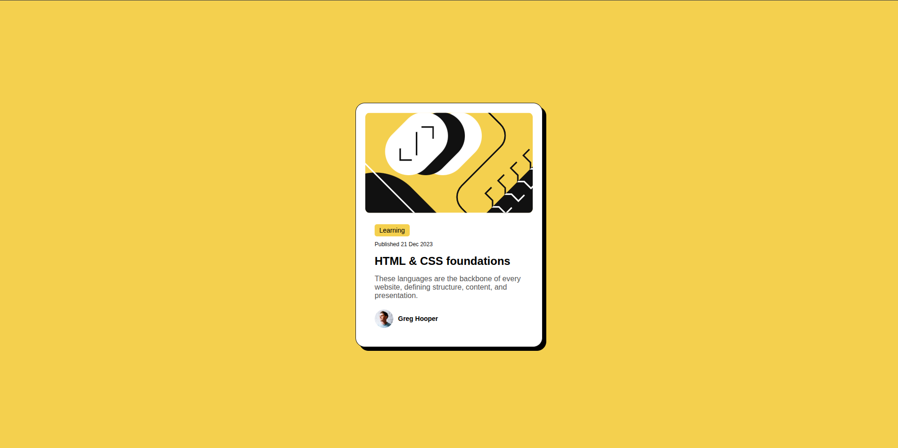

# Frontend Mentor - Blog preview card solution

This is a solution to the [Blog preview card challenge on Frontend Mentor](https://www.frontendmentor.io/challenges/blog-preview-card-ckPaj01IcS). Frontend Mentor challenges help you improve your coding skills by building realistic projects.

## Table of contents

- [Overview](#overview)
  - [Screenshot](#screenshot)
  - [Links](#links)
- [My process](#my-process)
  - [Built with](#built-with)
  - [What I learned](#what-i-learned)
  - [Continued development](#continued-development)
  - [Useful resources](#useful-resources)
  - [AI Collaboration](#ai-collaboration)
- [Author](#author)

---

## Overview

### Screenshot



### Links

- Solution URL: [Solution](https://github.com/TallamGilbert/Blog-preview-card)
- Live Site URL: [Live site](https://blog-preview-card-six-rho.vercel.app/)

---

## My process

### Built with

- Semantic HTML5 markup
- CSS custom properties
- Flexbox
- BEM methodology

### What I learned

This challenge helped me get more comfortable with BEM on a slightly more complex component than a single card. I was consistent with `__element` naming across almost all classes, though I caught one slip where I named a wrapper div `.blog-content` instead of `.blog-card__content`:

```html
<!--  Before -->
<div class="blog-content">
  <!--  After -->
  <div class="blog-card__content"></div>
</div>
```

I also learned to think more carefully about semantic HTML — the category label was initially wrapped in an `<h2>` when it should be a `<span>`, and the actual title should carry the heading tag:

```html
<span class="blog-card__category">Learning</span>
<h2 class="blog-card__title">HTML & CSS foundations</h2>
```

### Continued development

I want to keep focusing on:

- Writing semantic HTML first before adding BEM classes
- Planning my BEM block/element structure before touching any CSS
- Using BEM modifiers (`--`) for state changes like hover effects, rather than writing separate selectors

### Useful resources

- [BEM Methodology](https://getbem.com/) - The go-to reference for understanding blocks, elements, and modifiers.
- [MDN: HTML elements reference](https://developer.mozilla.org/en-US/docs/Web/HTML/Element) - Helpful for picking the right semantic element for each piece of content.

### AI Collaboration

- **Tool used:** Claude (Anthropic)
- **How I used it:** Reviewed my HTML and CSS for BEM compliance. Claude flagged the `.blog-content` naming inconsistency and the semantic heading order issue.
- **What worked well:** Getting a structured breakdown of what was correct and what needed fixing made the review process much faster than going through it manually.

---

## Author

- Frontend Mentor - [@TallamGilbert](https://www.frontendmentor.io/profile/TallamGilbert)
